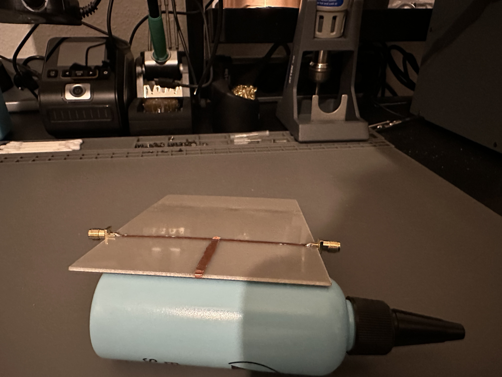

# Microstrip Line Experiment

## Goal
- See how λ/4 and λ/2 transformers behave
- Check their basic properties
- Observe what they do to signal transmission

## Setup
- FR4 board with single-sided copper (~1.5 mm thick)
- 50 Ω main microstrip line (~3 mm wide)
- λ/4 and λ/2 transformers / resonators (3 mm wide) hooked up to the main line
- Measure S21 using a LiteVNA
- Note:
   - Measurements are a bit rough because the microstrip lines are cut by hand, introducing some inaccuracies
   - The FR4 board doesn't have an exact ε_r; it's somewhere between the typical FR4 range (~4.3–4.7), so results may vary slightly
   - Simulation to this Setup: [Microstrip Lines and λ Transformer Simulation](HF-Simulations (openEMS)/Microstrip Lines and λ Transformer (Simulation))

## Theory
- A λ/4 line flips Open ↔ Short
- A λ/2 line keeps the load impedance the same
- Resonance effects occur at specific frequencies

## Measurements

1. **Measurement 1**
   - **Setup:**
   
       50 Ω microstrip
     
       
   
   - **Action:**
      - Measure S21
   - **Observation / Note:**
      - transmission line is okay matched to 50 Ω

2. **Measurement 2**
   - **Setup:**
     
       λ/4 transformer (~4cm @1GHz) with shorted end
   
       
     
   - **Action:**
     
       Measure S21
     
       
       
   - **Observation / Note:**
     - Shorted ~4 cm microstrip
     - At 1 GHz: the λ/4 line transforms the short into an open → S21 ≈ -0.5 dB (acts like a **band-pass**)
     - At 2 GHz: the λ/2 line transforms the short into a short → S21 ≈ -23 dB (acts like a **band-stop / notch filter**)
     - Matches what theory says

3. **Measurement 3**
   - **Setup:**
     
       λ/4 transformer (~4 cm @ 1 GHz) with **open end** (same as Measurement 2, just end is open now)
   - **Action:** Measure S21
     
       Measure S21
        
       
   - **Observation / Note:**
     - At 1 GHz: λ/4 line transforms the open to a short → S21 ≈ -23 dB (**band-stop / notch**)  
     - At 2 GHz: λ/2 line transforms the open to an open → S21 ≈ -1.2 dB (**band-pass**)  
     - Effect is reversed compared to shorted end; theory matches

4. **Measurement 4**
   - **Setup:**

      2x λ/4 transformers (~4 cm @ 1 GHz) with shorted ends, 1 mm gap in between
     
      
   - **Action:**
     
       Measure S21
     
       
   - **Observation / Note:** Combined effects on transmission
     - Flanks of resonance become steeper due to coupling
     - Bandwidth slightly narrower than single line
     - Open ↔ Short behavior still holds
     - Overall transmission looks like theory predicts

## End Note
- All measurements behave as expected
- **Single λ/4 line**: transforms Open ↔ Short, as theory predicts
- **Single λ/2 line**: transforms Open → Open and Short → Short
- **λ/4 line**:
  - **Short-ended:** behaves like a parallel resonant circuit → dips (band-stop)
  - **Open-ended:** behaves like a series resonant circuit → peaks (band-pass)
- Overall, experiment matches theory
