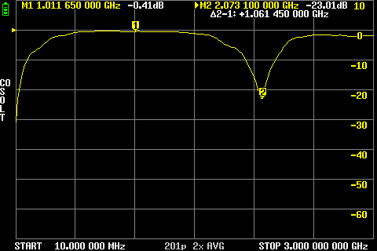
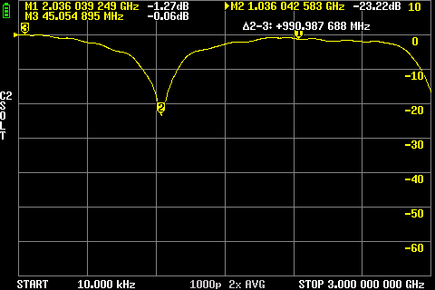

# Microstrip Line Experiment

## Goal
- Understand the behavior of λ/4 and λ/2 transformers
- Verify their basic properties
- Observe their effect on signal transmission

## Setup
- FR4 board with single-sided copper, ~1.5 mm thick
- 50 Ω main microstrip line, ~3mm wide
- λ/4 and λ/2 transformer / resonator (3mm wide) connected directly to the main line 
- Measurement of S21 using a LiteVNA

## Theory
- λ/4 transformers are used for impedance matching
- A λ/4 line transforms an open circuit into a short circuit and vice versa
- λ/2 lines repeat the impedance of the load
- Resonance effects occur at specific frequencies

## Measurements

1. **Measurement 1**
   - **Setup:**
   
       50 Ω microstrip
     
       
   
   - **Action:**
      - Measure S21
   - **Observation / Note:**
      - transmission line is okay matched to 50 Ω

2. **Measurement 2**
   - **Setup:**
     
       λ/4 transformer (~2cm @1GHz) with shorted end
   
       
     
   - **Action:**
     
       Measure S21
     
       
       
   - **Observation / Note:**
     - Shorted ~2 cm microstrip
     - At 1 GHz: the λ/4 line transforms the short into an open → S21 ≈ -0.5 dB (acts like a **band-pass**)
     - At 2 GHz: the λ/2 line transforms the short into a short → S21 ≈ -23 dB (acts like a **band-stop / notch filter**)
     - Behavior matches theoretical expectations

3. **Measurement 3**
   - **Setup:**
     
       λ/4 transformer (~2 cm @ 1 GHz) with **open end** (same as Measurement 2, but the end is now open)
   - **Action:** Measure S21
     
       Measure S21
        
       
   - **Observation / Note:**
     - At 1 GHz: λ/4 line transforms the open to a short → S21 ≈ -23 dB (**band-stop / notch**)  
     - At 2 GHz: λ/2 line transforms the open to an open → S21 ≈ -1.2 dB (**band-pass**)  
     - Behavior matches theoretical expectations: the effect is reversed compared to the shorted end measurement

4. **Measurement 4**
   - **Setup:**

      2x λ/4 transformer (~2 cm @ 1 GHz) with shorted end with 1mm gap inbetween
     
      
   - **Action:**
     
       Measure S21
     
       
   - **Observation / Note:** Combined effects on transmission
     - Flanks of resonance become steeper due to coupling
     - Bandwidth slightly narrower than single line
     - Open ↔ Short behavior still holds
     - Overall transmission matches theoretical expectations