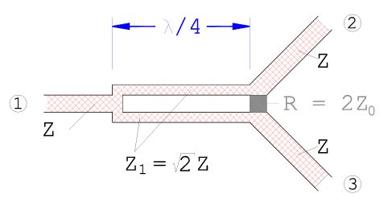
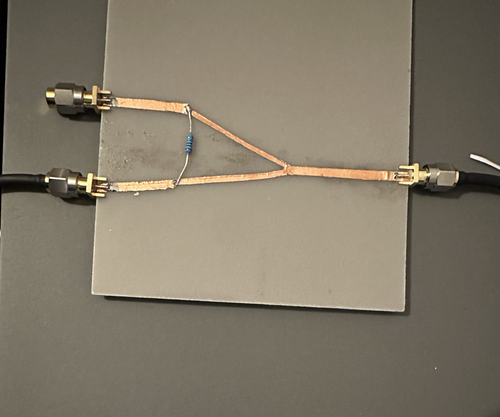
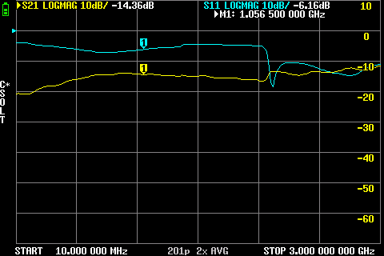

# Wilkinson Power Divider with Microstrip (FAILED – structure was bad and SMD resistor needed)

## Goal
- Try building a Wilkinson Power Divider at 1 GHz
- Check how it splits power and matches the ports
- Learn from the design and see what works and what doesn’t

## Setup
- FR4 board with single-sided copper (~1.5 mm thick)
- 50 Ω main microstrip line (~3 mm wide)
- λ/4 microstrip section: ~37 mm long, 1.5 mm wide (~70 Ω)
- 100 Ω wire resistor
- Wilkinson
- Simulation to this Setup: [Wilkinson Power Divider](../../HF-Simulations_openEMS/Wilkinson)

## Theory
- A Wilkinson Power Divider splits input power evenly between two outputs (~-3 dB each)
- All ports are ideally matched, and the divider is theoretically lossless
- Isolation resistor ensures that the outputs don’t interfere with each other
- The λ/4 lines transform impedances to make everything match nicely

    

## Measurements

- **Setup:**
  
    
   
- **Action:**
    Measure S21,S31,S11
  
    Port 2
  
    
    
    Port 3
  
    
     
    
- **Observation / Note:** 
    - Used copper tape + wire resistor instead of proper 100 Ω SMD → poor match
    - S11 very high (-1…-6 dB)
    - S21/S31 too low (-9…-14 dB) because power is reflected instead of split
