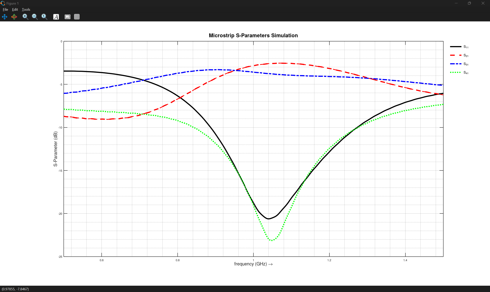
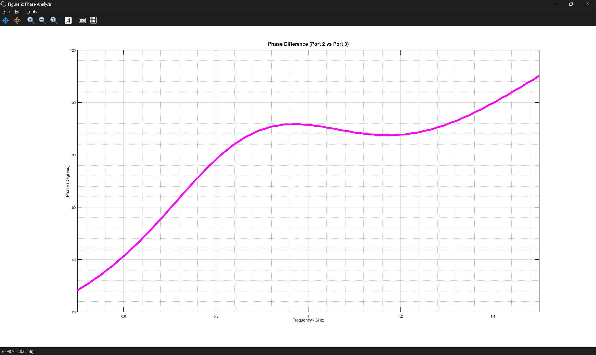

# Branch Line Coupler
## Goal
- simulate a Branch Line Coupler at 1 GHz
- Check how it splits power and matches the ports

## Setup
- FR4 board with single-sided copper (1.5 mm thick, Er ~ 4.2)
- 50 Ω main microstrip line (3 mm wide)
- λ/4 microstrip section: 37 mm long, 6.3 mm wide (~35 Ω)

## Theory

- Quadrature Hybrid: The Branch Line Coupler is a 4-port network that splits input power evenly (~-3 dB) between the "through" port and the "coupled" port.
- Phase Shift: The two output signals have a 90° phase difference relative to each other.
- Impedance Matching & Isolation: At the design frequency, all ports are ideally matched to 50 Ω, and the fourth port (isolated port) receives no power due to destructive interference.
- Quarter-Wave Sections: The coupler consists of four $\lambda/4$ microstrip lines. To achieve a 3 dB split in a $Z_0 = 50\ \Omega$ system:
    - The horizontal (series) arms must have an impedance of $Z_0 / \sqrt{2} \approx 35.4\ \Omega$.
    - The vertical (shunt) arms must have an impedance of $Z_0 = 50\ \Omega$.

## Simulations

- **Setup:**

    

- **Action:**

    - simulate S21,S31,S11

        

    - simulate Phase Difference
    
        
 
     
    
- **Observation / Note:**
    - The simulation results show a functioning Branch Line Coupler, but with a slight frequency offset
    - Resonance and Phase Shift: The ideal -90° phase difference and the best impedance matching ($S_{11}$) as well as isolation ($S_{41}$) occur at approximately 1.05 GHz. This is primarily due to the **Effective Dielectric Constant ($\epsilon_{eff}$)**. While the substrate material has $\epsilon_r = 4.2$, the microstrip fields also propagate through the surrounding air. This results in a lower $\epsilon_{eff}$ (approx. 3.0–3.3). A lower $\epsilon_{eff}$ increases the phase velocity, making the physical lines appear electrically "shorter" to the signal, which shifts the operating frequency upwards.
    - Power Splitting Performance: The magnitude of both reach ~-3 dB. At the actual phase-resonance point (1.05 GHz), there is a slight imbalance (approx. -2.5 dB vs -3.5 dB). This indicates that while the phase is correct at this point, the impedance ratios (widths) are slightly off due to the rounding of dimensions in the setup.
    - Design Conclusion: To move the best matching and phase shift from 1.05 GHz down to the target 1 GHz, the physical length of the branches should be changed. Additionally, fine-tuning the line widths would improve the magnitude balance at the resonance point.

    
