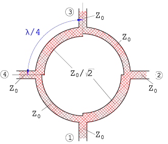

# Branch Line Coupler
## Goal
- simulate a Branch Line Coupler at 1 GHz
- Check how it splits power and matches the ports

## Setup
- FR4 board with single-sided copper (1.5 mm thick, Er ~ 4.2)
- 50 Ω main microstrip line (3 mm wide)
- λ/4 microstrip section: 37 mm long, 6.3 mm wide (~35 Ω)

    

## Theory

- Quadrature Hybrid: The Branch Line Coupler is a 4-port network that splits input power evenly (~-3 dB) between the "through" port and the "coupled" port.
- Phase Shift: The two output signals have a 90° phase difference relative to each other.
- Impedance Matching & Isolation: At the design frequency, all ports are ideally matched to 50 Ω, and the fourth port (isolated port) receives no power due to destructive interference.
- Quarter-Wave Sections: The coupler consists of four $\lambda/4$ microstrip lines. To achieve a 3 dB split in a $Z_0 = 50\ \Omega$ system:
    - The horizontal (series) arms must have an impedance of $Z_0 / \sqrt{2} \approx 35.4\ \Omega$.
    - The vertical (shunt) arms must have an impedance of $Z_0 = 50\ \Omega$.

## Simulations

- **Setup:**
  

   
- **Action:**
  
 
     
    
- **Observation / Note:** 
   

    
