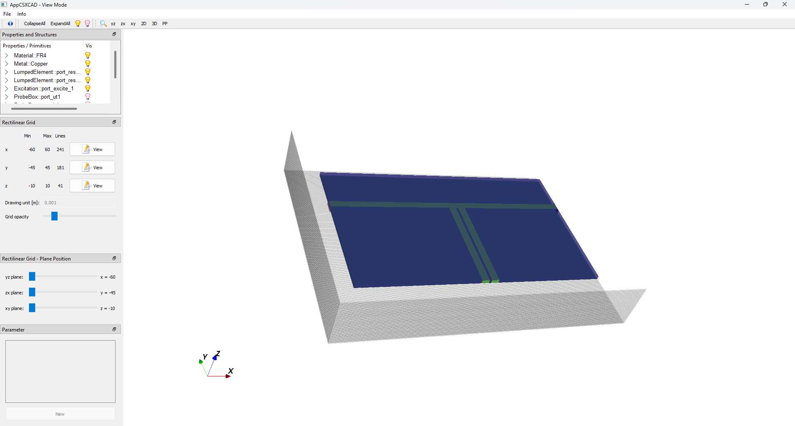
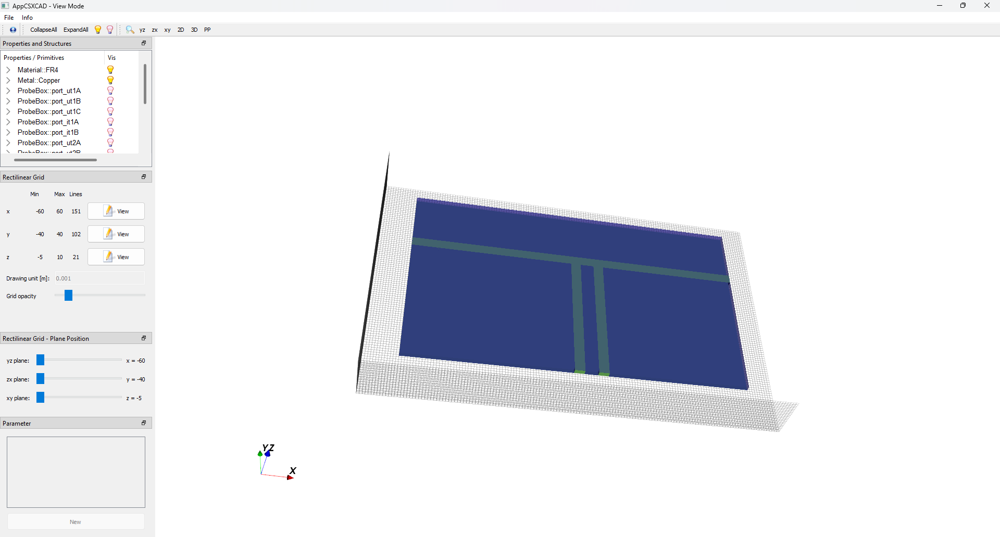
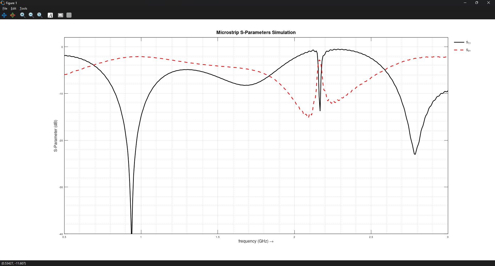
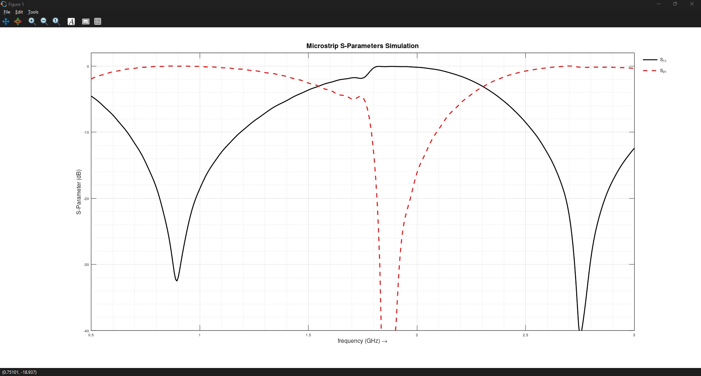

# Microstrip Lines and λ Transformer Simulation

This simulation replicates the **Microstrip Line Experiment**: [Microstrip Lines and λ Transformer](../../HF-Projects/MicrostripLineAndLambdaTransformer)

## Goal
- Simulate λ/4 and λ/2 transformers on a microstrip line
- Verify their effects on signal transmission
- Compare simulated results with experimental measurements

## Setup
- **openEMS**: See Microstrip_Lines_and_λ_Transformer.m for the full setup (traded some accuracy for shorter simulation time)
- FR4 board with single-sided copper (1.5 mm thick)
- 50 Ω main microstrip line (3 mm wide)
- λ/4 and λ/2 transformers / resonators (3 mm wide) hooked up to the main line
- Shorted and open-ended terminations
- simulate S21 over frequency

## Theory
- λ/4 line transforms Open ↔ Short at its resonant frequency
- λ/2 line keeps the load impedance the same
- Resonance effects appear as peaks or dips in transmission (S21)

## Simulation Observations

1. **Measurement**
    - **Setup:**
        50 Ω microstrip
    
        
    
    - **Action:**
        Simulate S21,S11
      
        
    - **Observation / Note:**
    
        transmission line is matched to 50 Ω

2. **Measurement**
   - **Setup:**
     
       λ/4 transformer (4cm @~1GHz) with shorted end
   
       
     
   - **Action:**
     
       Measure S21, S11
     
       
       
   - **Observation / Note:**
     - At ~1 GHz: the λ/4 line transforms the short into an open → S21 ≈ 0 dB (acts like a **band-pass**)
     - At ~2 GHz: the λ/2 line transforms the short into a short → S21 ≈ -40 dB (acts like a **band-stop / notch filter**)
     - Matches what theory says

3. **Measurement**
   - **Setup:**
     
       λ/4 transformer (4cm @~1GHz) with open end
   
       
     
   - **Action:**
     
       Measure S21, S11
     
       
       
   - **Observation / Note:**
     - At ~1 GHz: the λ/4 line transforms open into an short → S21 ≈ -43dB (acts like a **band-stop / notch filter**)
     - At ~2 GHz: the λ/2 line transforms the open into a open → S21 ≈ 0 dB (acts like a **band-pass**)
     - At ~3 GHz: the 3rd harmonic shows up → partial notch, S21 only drops a bit (-35 dB)
     - Matches what theory says
       
4. **Measurement**
   - **Setup:**

      2x λ/4 transformers (4 cm @ ~1 GHz) with shorted ends, 1 mm gap in between
     
      

      2x λ/4 transformers (4 cm @ ~1 GHz) with shorted ends, 4 mm gap in between

      
   - **Action:**
     
       Measure S21,S11
     
       2x λ/4 transformers (4 cm @ ~1 GHz) with shorted ends, 1 mm gap in between
     
       

       2x λ/4 transformers (4 cm @ ~1 GHz) with shorted ends, 4 mm gap in between
   
       
     
       
   - **Observation / Note:** Combined effects on transmission
       - **Simulation**: 2 λ/4 shorts → **two resonance dips**  
       - **Real experiment**: same layout → **single dip** + S21 outside resonance almost 0 dB.
       - Why? Perfect geometry in sim → coupled resonators → standing waves. Reality = imperfections + losses → smoother, nicer-looking results
       - Two λ/4 shorts act like **coupled resonators**.
       - Simulation shows **resonance splitting** → two dips (Modesplitting) due to strong coupling.
       - 4 mm gap → Simulation shows weaker coupling → no strong mode splitting
    
    
## End Note

Almost everything behaves as expected, but there are some quirks between simulation and real measurements:

- **In the simulation, the 4 cm stub is not exactly λ/4 at 1 GHz – it actually corresponds more closely to ~900 MHz.**

- **Single λ/4 line**  
  - Transforms Open ↔ Short exactly as theory predicts.  

- **Single λ/2 line**  
  - Transforms Open → Open and Short → Short, just like expected.  

- **λ/4 line behavior**:  
  - **Short-ended:** acts like a parallel resonant circuit → you get dips (band-stop).  
  - **Open-ended:** acts like a series resonant circuit → you get peaks (band-pass).  

### Differences compared to real experiments
   - FR4 and copper losses in real life **flatten the resonances**, smoothing peaks and troughs.  
   - Simulations assume **perfect metal & lossless dielectric**, which makes dips sharper and S21 more sensitive.
   - Geometry imperfections in the real layout → small misalignments, uneven gaps, or slightly different stub lengths → resonances shift and broaden.
   - Connector and assembly effects can add parasitic reflections or small additional losses, further smoothing the respons

