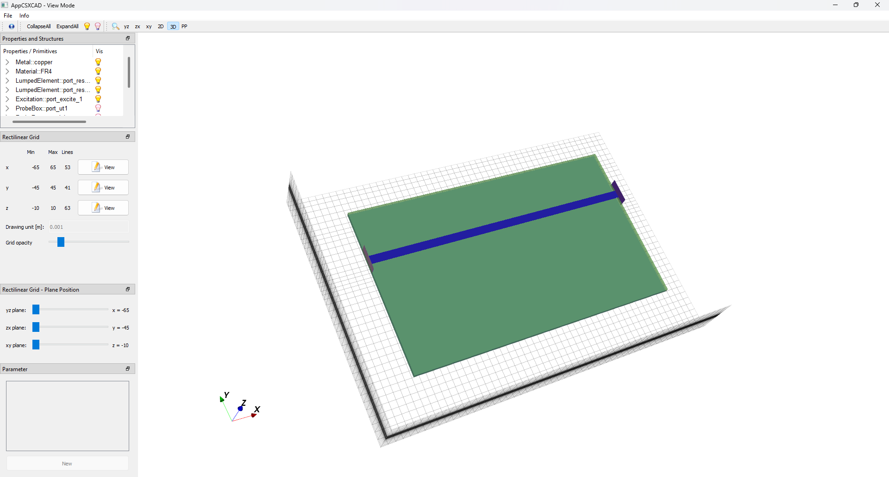
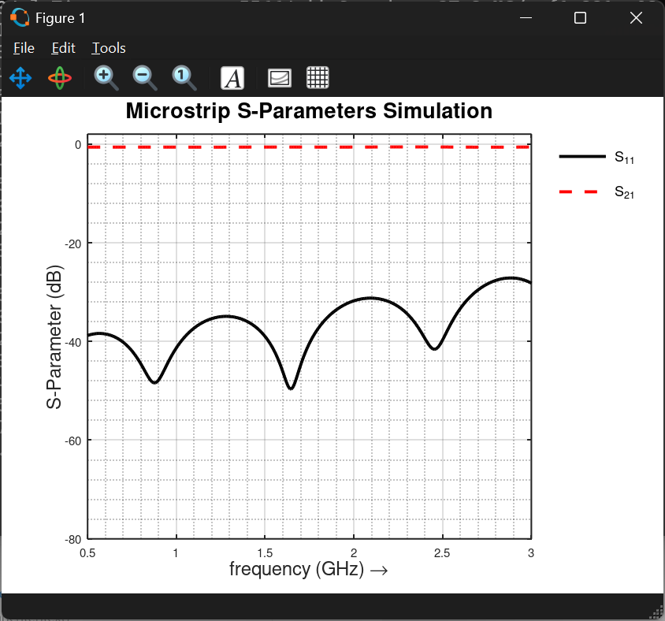
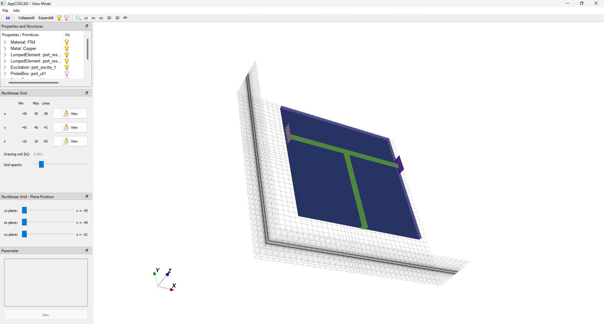
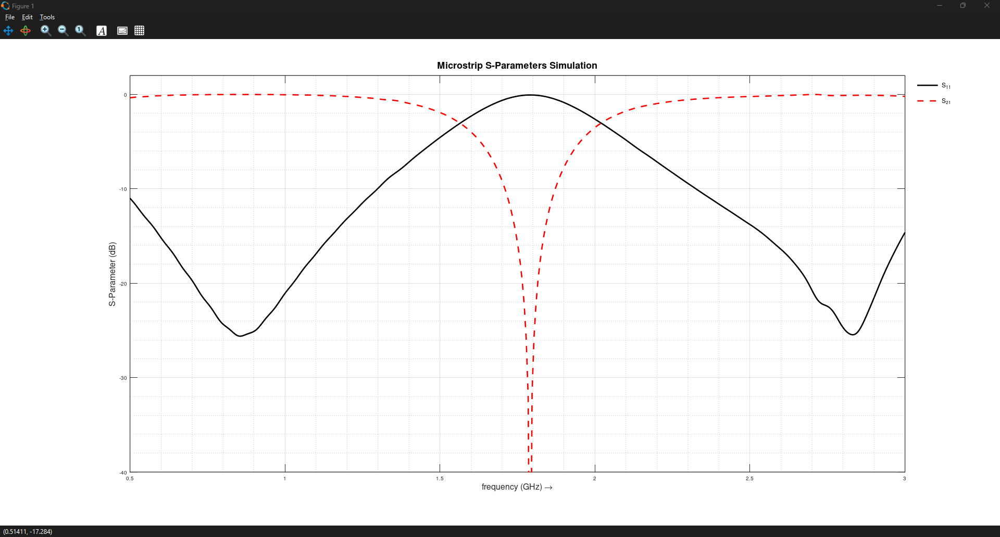
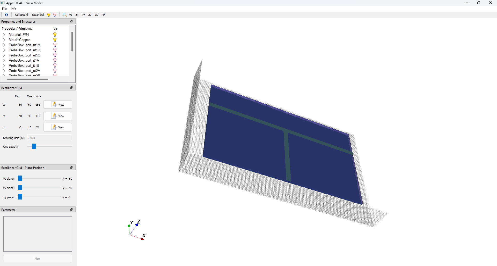
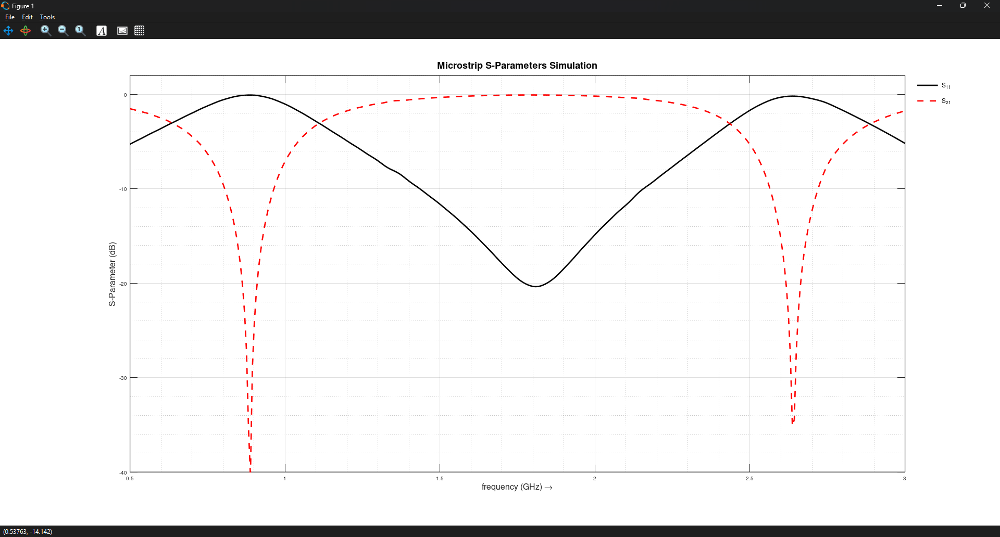

# Microstrip Lines and λ Transformer Simulation

This simulation replicates the **Microstrip Line Experiment**: [Microstrip Lines and λ Transformer](../../HF-Projects/MicrostripLineAndLambdaTransformer)

## Goal
- Simulate λ/4 and λ/2 transformers on a microstrip line
- Verify their effects on signal transmission
- Compare simulated results with experimental measurements

## Setup
- **openEMS**: See Microstrip_Lines_and_λ_Transformer.m for the full setup (traded some accuracy for shorter simulation time)
- FR4 board with single-sided copper (1.5 mm thick)
- 50 Ω main microstrip line (3 mm wide)
- λ/4 and λ/2 transformers / resonators (3 mm wide) hooked up to the main line
- Shorted and open-ended terminations
- simulate S21 over frequency

## Theory
- λ/4 line transforms Open ↔ Short at its resonant frequency
- λ/2 line keeps the load impedance the same
- Resonance effects appear as peaks or dips in transmission (S21)

## Simulation Observations

1. **Measurement**
    - **Setup:**
        50 Ω microstrip
    
        
    
    - **Action:**
        Simulate S21,S11
      
        
    - **Observation / Note:**
    
        transmission line is matched to 50 Ω

2. **Measurement**
   - **Setup:**
     
       λ/4 transformer (4cm @1GHz) with shorted end
   
       
     
   - **Action:**
     
       Measure S21, S11
     
       
       
   - **Observation / Note:**
     - At ~1 GHz: the λ/4 line transforms the short into an open → S21 ≈ -2 dB (acts like a **band-pass**)
     - At ~2 GHz: the λ/2 line transforms the short into a short → S21 ≈ -40 dB (acts like a **band-stop / notch filter**)
     - Matches what theory says

3. **Measurement**
   - **Setup:**
     
       λ/4 transformer (4cm @1GHz) with open end
   
       
     
   - **Action:**
     
       Measure S21, S11
     
       
       
   - **Observation / Note:**
     - At 1 GHz: the λ/4 line transforms open into an short → S21 ≈ -2 dB (acts like a **band-stop / notch filter**)
     - At 2 GHz: the λ/2 line transforms the open into a open → S21 ≈ -43 dB (acts like a **band-pass**)
     - Matches what theory says

## End Note

