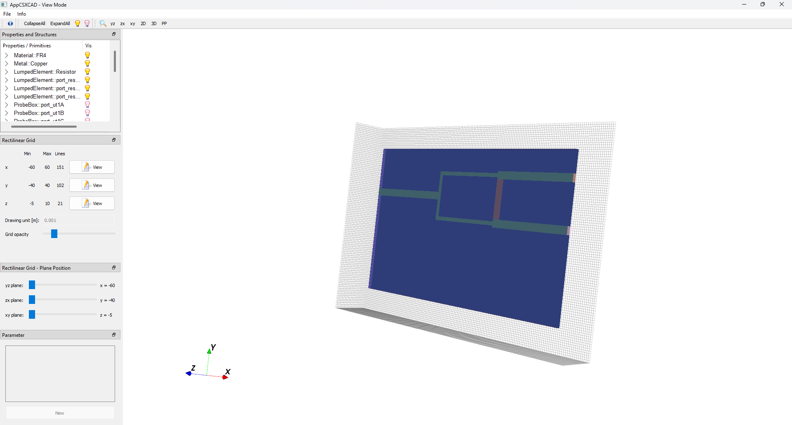
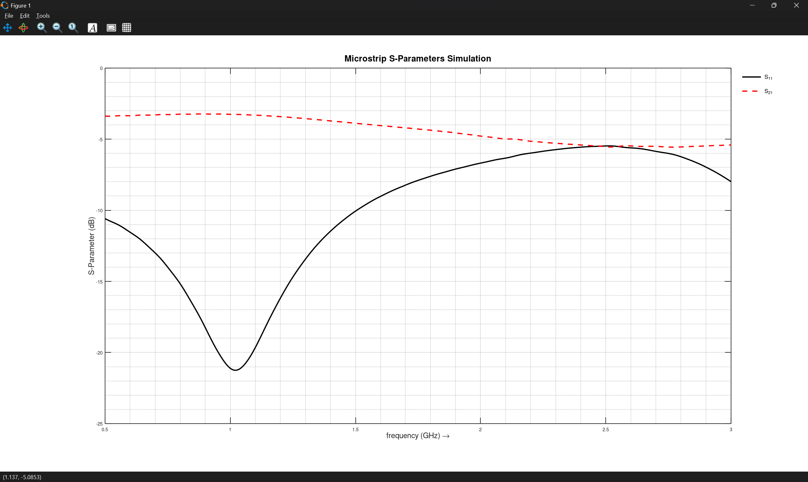
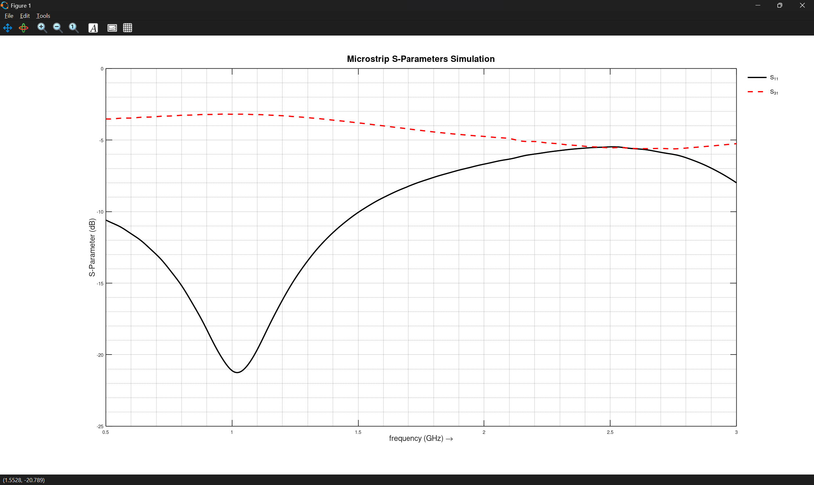
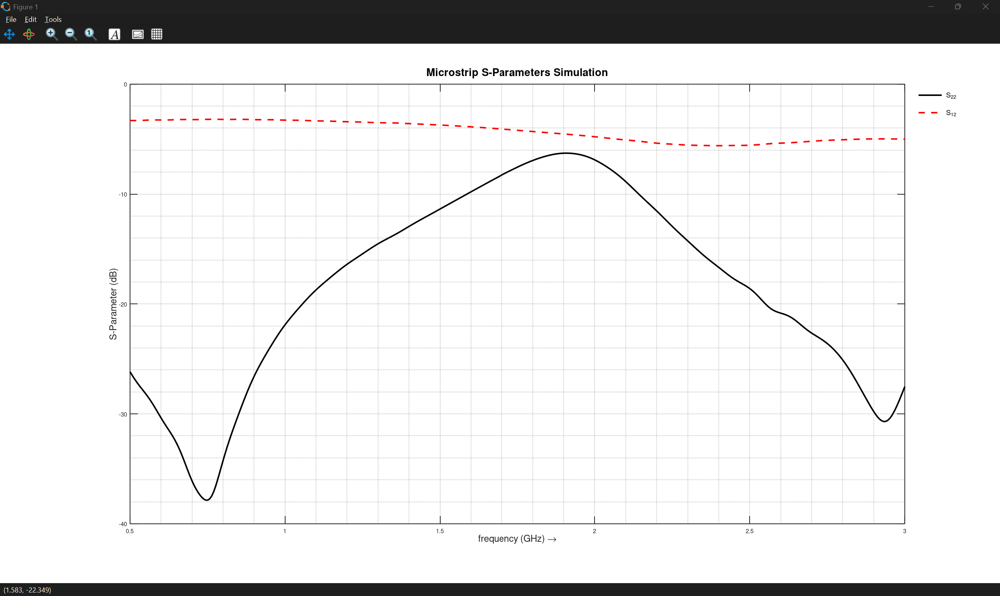
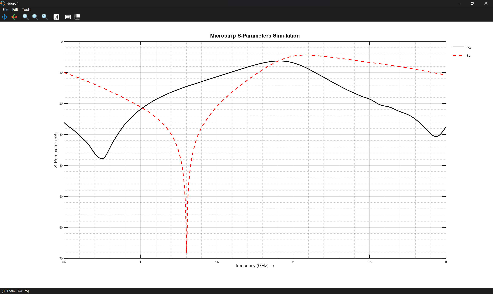
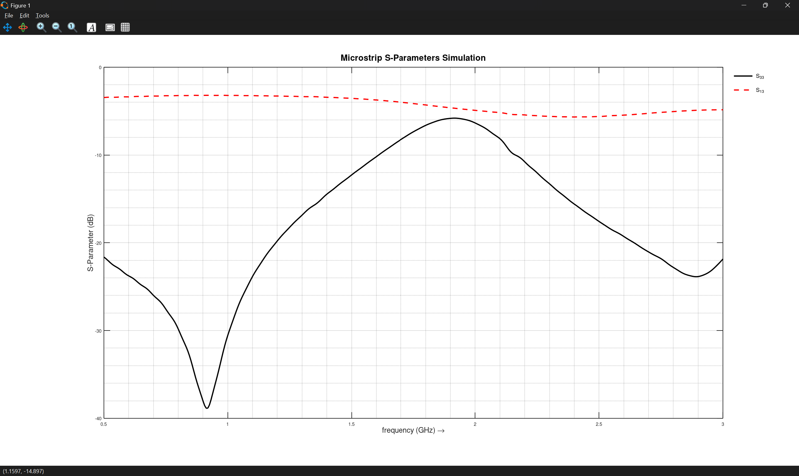
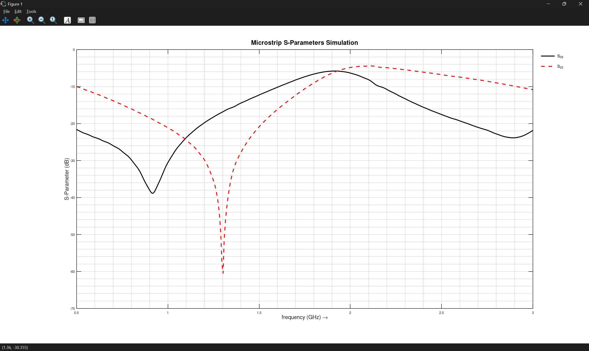

# Wilkinson Power Divider with Microstrip
## Goal
- Try simulate a Wilkinson Power Divider at 1 GHz
- Check how it splits power and matches the ports

## Setup
- FR4 board with single-sided copper (1.5 mm thick)
- 50 Ω main microstrip line (3 mm wide)
- λ/4 microstrip section: 3.7 mm long, 1.5 mm wide (~70 Ω)
- 100 Ω resistor

## Theory
- A Wilkinson Power Divider splits input power evenly between two outputs (~-3 dB each)
- All ports are ideally matched, and the divider is theoretically lossless
- Isolation resistor ensures that the outputs don’t interfere with each other
- The λ/4 lines transform impedances to make everything match nicely

    

## Simulations

- **Setup:**
  
    
   
- **Action:**
  
    - simulate S21,S31,S11
  
        Port 2
      
        
        
        Port 3
      
        

    - simulate S12,S32,S22
  
        Port 1
      
        
        
        Port 3
      
        

    - simulate S13,S23,S33
  
        Port 1
      
        
        
        Port 2
      
        
     
    
- **Observation / Note:** 
    - The transmission parameters S21, S31, S12, and S13 are around −3 dB at approximately 1 GHz, which shows that the input power is equally split between the two output ports.
    - The return loss at Port 1, Port 2, and Port 3 is better than −20 dB at the design frequency, indicating good impedance matching.
    - The results also demonstrate the typical properties of a Wilkinson power divider:
        - he structure is symmetric, as both output branches behave similarly.
        - The circuit is reciprocal (e.g., S21 ≈ S12, S31 ≈ S13).
    - The output ports are well isolated from each other, which can be seen from the low values of S23 and S32, confirming proper operation of the isolation resistor.
    - When exciting Port 2 or Port 3, the signal appears at Port 1 with approximately −3 dB loss. 
        -Theoretically, if both ports are driven in phase simultaneously, the signals would combine at Port 1 with +3 dB compared to a single input, showing the combiner behavior.(the circuit can works as a power combiner)
    - Overall, the simulation results match the Wilkinson power divider/combiner.

    
