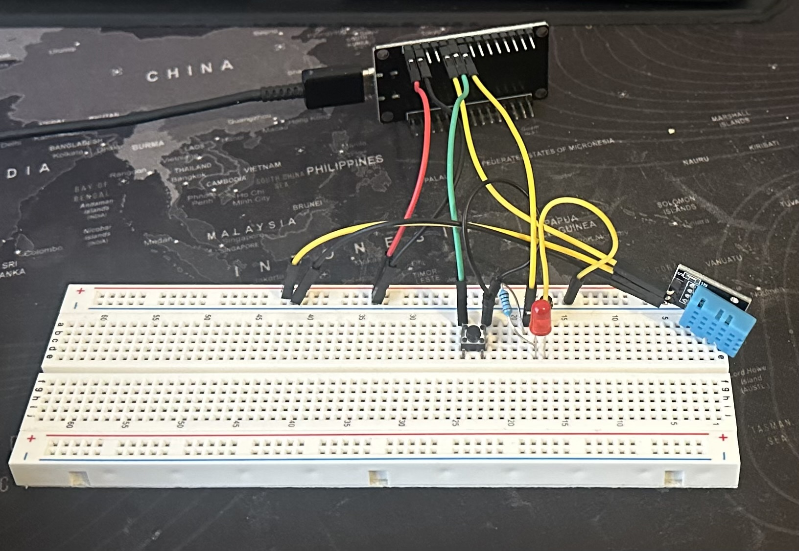

# Button + DHT11 Interrupt Example

A project to read a **button with an interrupt** while also reading a **DHT11 sensor** every 300 seconds.

Setup:
    

## How It Works

- Button press triggers an **interrupt** immediately (HIGH → LOW).  
-  ISR (`readSensor()`) sets a **flag**  
- Ensures **1 button press = 1 event**, even if the button mechanically bounces.
- Main loop checks the flag via `isButtonPressed()` and reacts (reads DHT11, prints values).  
- Software debounce prevents multiple triggers from quick or bouncing presses.  

## What is Learned

- Difference between **polling** (`digitalRead`) and **interrupts**.  
- How to safely handle **button presses with interrupts**.  
- Using a **flag** to communicate between ISR and main loop.    

## Flow

1. Button pressed → ISR sets `press = true`  
2. Loop checks `isButtonPressed()`  
3. Flag resets → action happens (DHT11 read & Serial print)  

