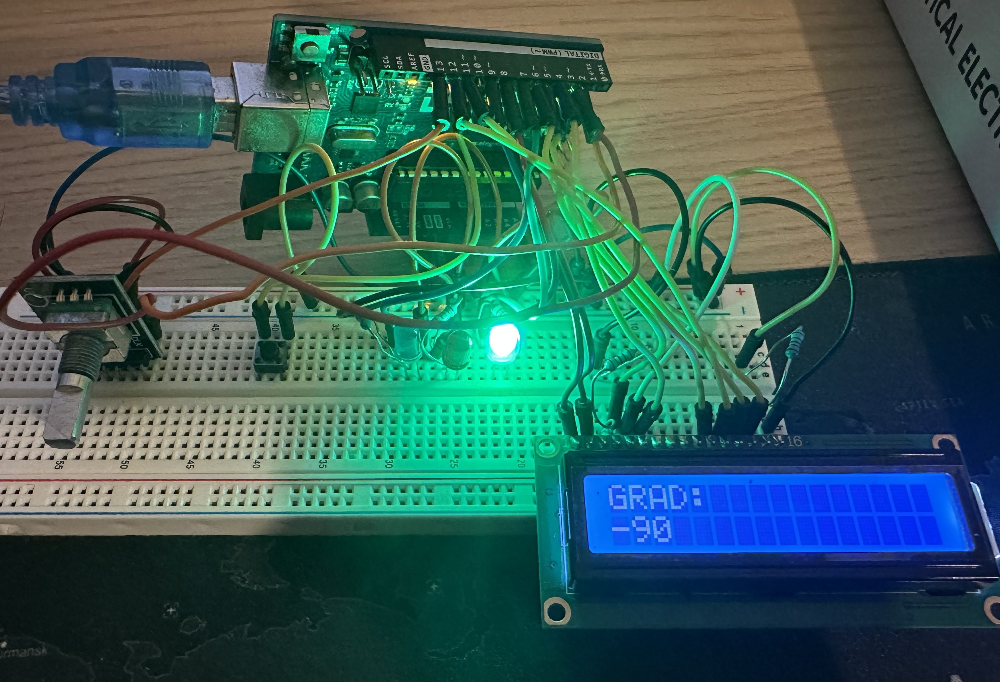

# Rotary Encoder + LCD + Button Interrupt Example

A project that reads a rotary encoder with interrupts, checks buttons, and displays the status on a 16x2 LCD. LEDs indicate mode and rotation direction.

## Setup

- Rotary encoder connected to pins `ENCODER_A` and `ENCODER_B`
- Button `BUTTON` for ON/OFF mode
- Button `SW` for reset
- LEDs `LEDRED`, `LEDGREEN`, `LEDBLUE` for status
- 16x2 LCD via `LiquidCrystal` library

## How It Works

1. **ON/OFF Button**  
   - Toggles `MODE` between ON and OFF.  
   - Uses simple software debounce with non-blocking Timer.
   - In ON mode, the encoder’s degrees are displayed on the LCD.  
   - LEDs indicate mode and rotation direction:
     - RED → OFF Mode (only Display is turned off)
     - GREEN/BLUE → Encoder direction

2. **RESET Button**  
   - Resets the rotary encoder counter to 0.  
   - Also uses software debounce.

3. **Rotary Encoder**  
   - Read via interrupts (`SIGNAL_AB`) → instant reaction to any rotation.  
   - Tracks direction and steps.  
   - Steps converted to degrees.  
   - `getROTA()` reads the current value atomically (interrupts temporarily disabled) to avoid inconsistent readings.

4. **LCD Display**  
   - Shows degrees (`rota_DEG`) in ON mode.  
   - Shows `"OFF MODE"` in OFF mode.  
   - Updates only when the degree changes (`lastDeg` prevents unnecessary refresh).

5. **LED Status**  
   - RED → OFF Mode active 
   - GREEN → Encoder rotated backward  
   - BLUE → Encoder rotated forward (Clockwise)

### Interrupts vs Polling

- Polling: Buttons are read in the loop with `digitalRead`. Simple but slower.  
- Interrupts: Encoder uses `attachInterrupt`. Immediate reaction independent of loop timing.

## Flow

1. Encoder rotated → `SIGNAL_AB` interrupt triggered → steps & direction updated.  
2. `BUTTON` pressed → `MODE` toggled (debounced).  
3. `SW` pressed → `rota_reset = true`.  
4. Main loop:
   - Checks `MODE` → updates LCD and LEDs  
   - Checks `rota_reset` → resets counter  
   - Reads current encoder steps via `getROTA()`  
   - Converts steps to degrees → displays on LCD  
   - Updates LEDs according to direction  

