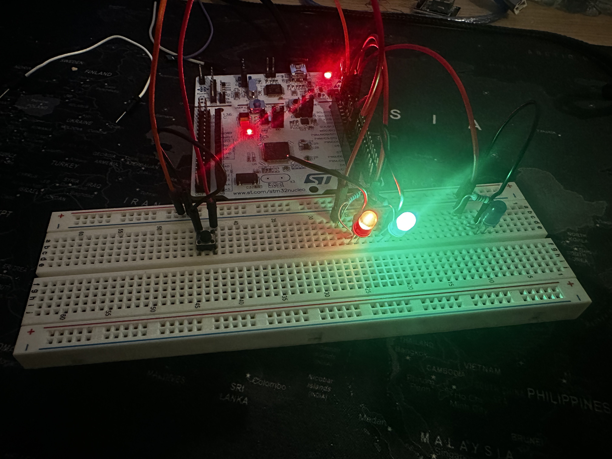

# STM32 Reaction Game Example

Simple STM32 project implementing a reaction-time game using LEDs and buttons.

## Features

- Uses three LEDs (Blue, Red, Green) to indicate game states.
- Measures reaction time when a button (`USER_BUTTON`) is pressed.
- Starts a new round when a second button (`B1`) is pressed.
- Sends feedback over UART with reaction time or early press messages.
- Implements a basic state machine.

## Purpose

This project serves as a quick example for STM32 to learn:

- GPIO input/output
- External interrupts
- Basic state machine programming
- Simple timing using `HAL_GetTick()`

