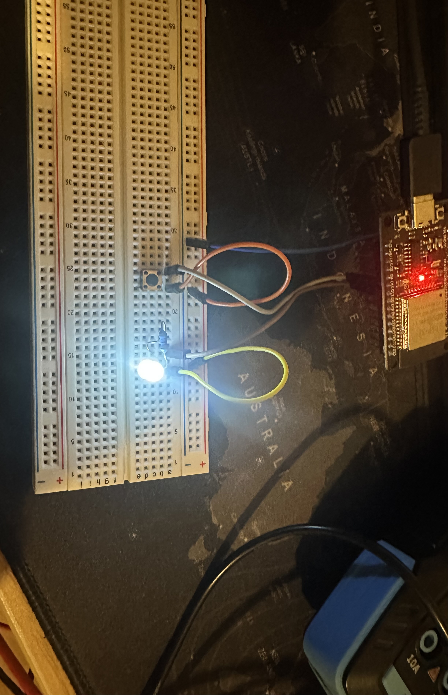

# Debouncing and Timers

This project is all about learning how to use **timers** on microcontrollers and how to deal with **button bouncing**. I tried a couple of different approaches and looked at the problems that can happen with buttons and LEDs.

## What’s the problem with timers?

Using `delay(xx)` makes the microcontroller **just sit and wait** until the time is up before moving on to the next line of code. During this waiting time, the MCU **doesn’t do anything else**, which is usually **not what you want** in real projects.  

A better approach is to use a **non-blocking timer**:

- Read the current time using a function like `millis()`  
- Save that time in a variable  
- Compare the current time to the saved time  
- Use the difference as your "delay" or timing check  

This way, your program can **keep running other tasks** while waiting, instead of freezing everything.  


## What’s the problem with buttons?

Mechanical buttons don’t give a clean HIGH/LOW signal when pressed. Instead, the contacts **bounce** for a few milliseconds, creating a bunch of rapid signals.  

This can lead to:

- **Multiple triggers** when you only wanted one (aka Dauerfeuer)  
- **Missed presses** if you press and release too quickly, if you press then release and press again before the debouncing delay is over 

Debouncing is basically just **filtering out those bounces** so that a single press counts as one event.

## Example with non-blocking Timer and 2 different Debouncing methods

###Setup:
     


1. **Multiple triggers** 

    when you only wanted one

    ```cpp
    // In this version, the button press is registered multiple times
    // if the button is held down continuously

    #include <Arduino.h>

    const int BUT = 16;      
    const int LEDPIN1 = 17; 
    unsigned long lastPressTime = 0;
    // 1 second debounce delay
    const unsigned long debounceDelay = 1000;   

    void setup() {
        Serial.begin(9600);
        pinMode(BUT, INPUT_PULLUP);
        pinMode(LEDPIN1, OUTPUT);
    }

    void loop() {
        // Read the current button state
        bool button = digitalRead(BUT);
        
        // Read the current time (non-blocking)
        unsigned long curTime = millis();

        // Check if the button is pressed AND debounce time has passed
        if(button == LOW && (curTime - lastPressTime) > debounceDelay){
            
            //Here the event is triggered
            Serial.println("buttonpressed");
            
            // Update lastPressTime to the current time
            lastPressTime = curTime;

            digitalWrite(LEDPIN1, !digitalRead(LEDPIN1));
        }
    }
    ```
    **Explanation of the problem:**
    - The event is triggered every time the condition `(button == LOW && curTime - lastPressTime > debounceDelay)` becomes true.

    - Because the button stays LOW while you hold it down, the condition will repeatedly become true every `debounceDelay` milliseconds → **multiple registrations** (Dauerfeuer).

    - There is no tracking of the last stable button state – the code only checks if enough time has passed, so it cannot tell if the button is still being held.

2. **Missed presses** 

    if you press and release too quickly, if you press then release and press again before the when you only wanted one

    ```cpp
        #include <Arduino.h>
        const int BUT = 16;
        const int LEDPIN1 = 17;
        const unsigned long debounceDelay = 1000;   // Debounce delay in ms
        unsigned long lastDebounceTime = 0;         // Stores the last time the button state changed
        bool lastButtonState = HIGH;                // Last reading from the button
        bool buttonState = HIGH;                    // Last stable button state
        bool LEDstatus = HIGH;

        void setup() {
        Serial.begin(9600);
        pinMode(BUT,INPUT_PULLUP);
        pinMode(LEDPIN1,OUTPUT);
        }

        void loop() {
            // Read the current button state
            bool button=digitalRead(BUT);

            //If the button reading changed, reset debounce timer
            if(button != lastButtonState){
                lastDebounceTime=millis();
            }

            // If the state has been stable longer than debounceDelay
            if((millis()-lastDebounceTime)>debounceDelay){

                 // Only trigger event if stable state changed
                if(button != buttonState){
                    buttonState=button;

                     // Trigger only on button press (LOW)
                    if(buttonState==LOW){

                    Serial.println("buttonpressed");
                    digitalWrite(LEDPIN1, !digitalRead(LEDPIN1));
                    }
                }
            }
            //Save the current reading for the next loop iteration
            lastButtonState=button;
        }
    ```
    **Explanation of the problem:**
    - In this version, buttonState stores the last stable button state, and the event only triggers when the state changes from HIGH → LOW, preventing repeated triggers while holding the button.
    - Short presses and quick bounces are still safely ignored, thanks to the debounce timer (lastDebounceTime).
    - In this debounce approach, the button state can only change if the **debounce delay has passed**.  
    - This means that if you press the button **again too quickly** before the timer expires, the press won’t be registered, no matter how long you hold it.  
    - In other words, you must wait at least one full debounce delay before the next press can trigger an event.  
    - This is a trade-off: it **prevents multiple triggers during a long press**, but also **blocks very fast repeated presses**.