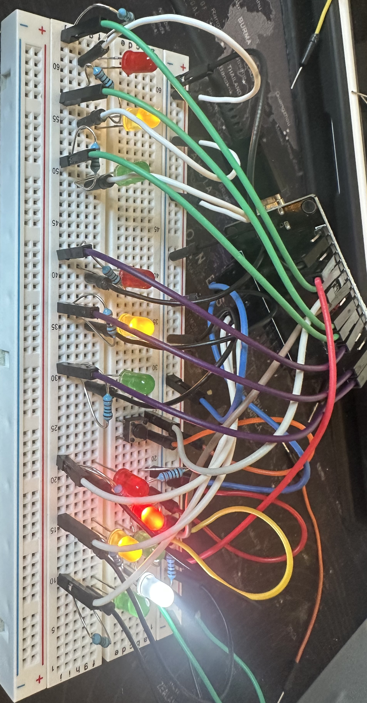

# Traffic Light Project 

A simple traffic light system using an ESP32 w:

##Setup

- Two parallel traffic lights
- One antiparallel traffic light + pedestrian light

---

## How it works

- Everything runs with **non-blocking timers** (`millis()`), so nothing ever stops the loop  
- Uses a **state machine** to manage light phases cleanly  
- Pedestrian button lets you switch the pedestrian light **if it’s not already green**  
- Traffic lights are synced so only one direction is green at a time  

---

## What you learn here

- Using **millis()** for timing instead of `delay()`  
- Handling **multiple states** in a microcontroller  
- Simple **button input + debouncing**  
- Coordinating multiple lights for safe traffic flow  

---

Pretty straightforward project, but a nice way to practice **timing, debouncing, states, and GPIO control**!